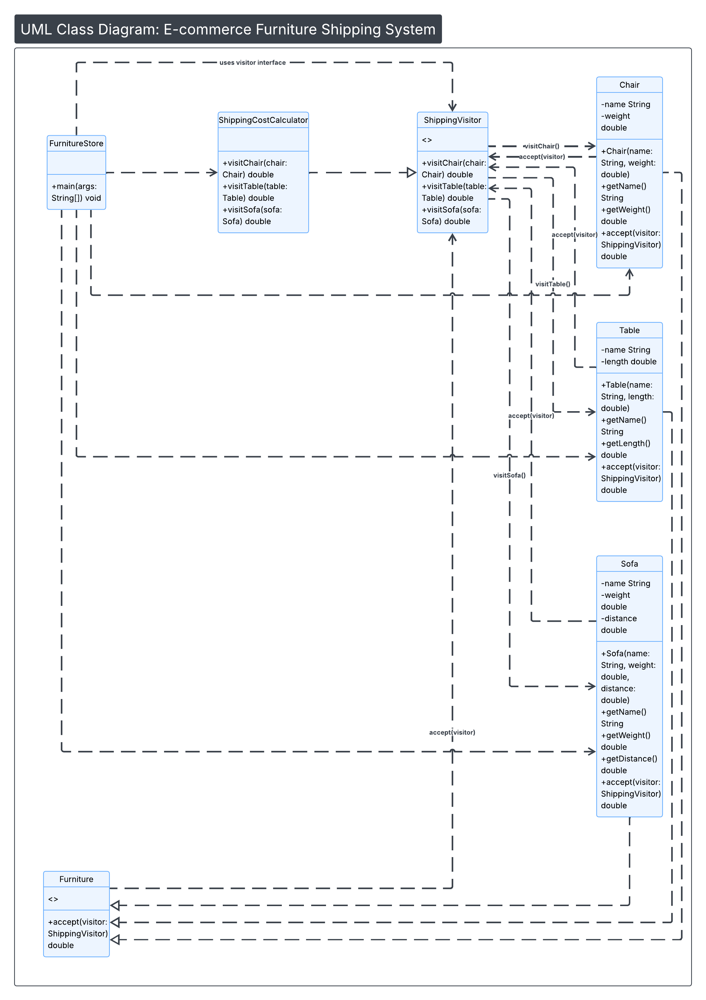

# Furniture Shipping Cost Calculator using Visitor Design Pattern

## Problem Scenario

You are a software developer working on an e-commerce platform that sells different types of furniture such as chairs, tables, and sofas. One important feature of the system is the ability to calculate the shipping cost of each furniture item.

Each type of furniture has a different shipping cost calculation. For example, chairs are lightweight and may have a flat shipping rate, tables may calculate shipping based on their size, and sofas are large and bulky which may require a calculation based on weight and delivery distance.

If the shipping logic is implemented directly inside each furniture class, the system would become tightly coupled and difficult to maintain. Adding new furniture types or new operations (such as tax computation, packaging cost, or discounts) would require modifying existing classes.

To solve this problem, the Visitor Design Pattern is used. The visitor pattern separates the algorithm (shipping cost calculation) from the objects (furniture types) on which it operates. Each furniture class accepts a visitor object that performs the shipping cost calculation depending on the furniture type.

This approach makes the system easier to extend and maintain. New operations can be added without modifying the existing furniture classes, and new furniture types can be integrated with minimal changes to the codebase.

---

## Design Pattern Used

Visitor Design Pattern

### Pattern Elements

* **Visitor Interface**

  * `ShippingVisitor`

* **Concrete Visitor**

  * `ShippingCostCalculator`

* **Element Interface**

  * `Furniture`

* **Concrete Elements**

  * `Chair`
  * `Table`
  * `Sofa`

* **Client**

  * `FurnitureStore`

---

## UML Diagram

The UML diagram below shows the structure of the Visitor Design Pattern implementation used in this project.



---

## How the Program Works

1. The program creates furniture objects such as Chair, Table, and Sofa.
2. A visitor object called `ShippingCostCalculator` is created.
3. Each furniture object calls the `accept()` method and passes the visitor.
4. The visitor determines the furniture type and calculates the corresponding shipping cost.
5. The calculated shipping cost is returned and displayed to the user.

---

## Example Output

```
Shipping cost for Office Chair : 20.0
Shipping cost for Dining Table : 25.0
Shipping cost for Living Room Sofa : 300.0
```

---

## Author

Angelo Joseph P. Cruz
BS Computer Science

